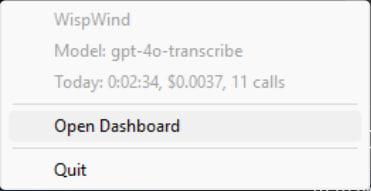
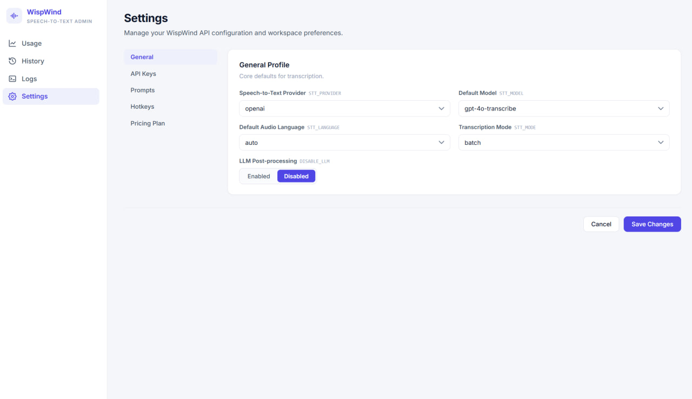
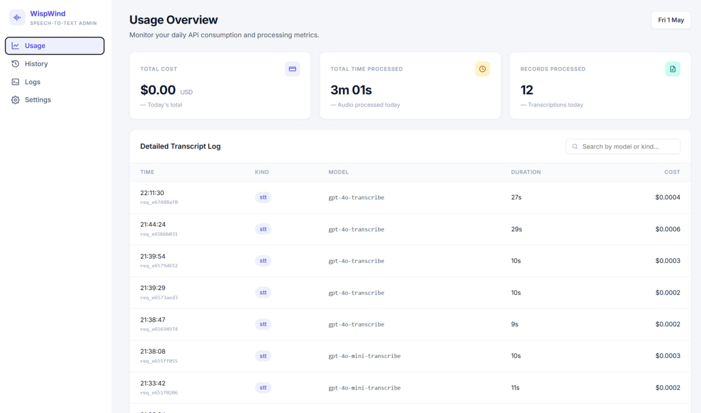

# WispWind

Windows desktop voice-typing utility. Hold or toggle a global hotkey, dictate, and the transcribed text is pasted into whatever input field is focused. Speech-to-text is done by OpenAI or Deepgram; an optional LLM pass cleans up punctuation and casing.

The app runs as a tray icon with a small floating overlay that shows audio level and status. A built-in admin web panel on `127.0.0.1:8182` is used for settings, usage stats, history and logs.

## Features

- Global hotkey dictation, hold or toggle mode
- `batch` mode (record while held, paste after release) and `realtime` mode (stream partial text into the focused field as you speak, OpenAI Realtime API only)
- STT providers: OpenAI (`gpt-4o-mini-transcribe`, `gpt-4o-transcribe`, etc.) and Deepgram (`nova-2`)
- Optional LLM post-processing via OpenAI `gpt-4o-mini` for punctuation/formatting
- Embedded admin panel: settings editor, today's usage with cost, dated history, log viewer
- Hot-reload of model, prompts, API keys and language without restarting (hotkey and STT mode still need a restart)
- SQLite-backed settings (`usage/wispwind.db`), `.env` is used only as a fallback for first-run defaults
- Single-instance mutex, system tray menu with current model and today's totals
- Daily log and history files written next to the executable

## Screenshots

| Tray menu                                                   | Recording widget                                                      |
| ----------------------------------------------------------- | --------------------------------------------------------------------- |
|  |  |

| Admin panel — Settings                          | Admin panel — Usage                                                    |
| ----------------------------------------------- | ---------------------------------------------------------------------- |
|  |  |

## Status

Windows 10/11 only. Audio capture, paste, focus tracking, global hotkeys and the floating overlay are implemented against Win32 APIs.

## Requirements

- Go 1.25+
- MSYS2 with `mingw-w64-x86_64-gcc`, `mingw-w64-x86_64-pkg-config`, `mingw-w64-x86_64-portaudio`, `mingw-w64-x86_64-zlib`, `mingw-w64-x86_64-libpng`
- An OpenAI and/or Deepgram API key

CGO is required to build the static PortAudio bindings. The build script prepends `C:\msys64\mingw64\bin` to `PATH` automatically.

## Download

Pre-built Windows executables are available on the [Releases](../../releases) page. Each release includes `wispwind.exe` and `.env.example`.

1. Download both files to the same folder.
2. Rename `.env.example` to `.env` and set your API key:
   ```env
   OPENAI_API_KEY=sk-your-key
   ```
3. Run `wispwind.exe`. The tray icon appears and the admin panel opens at `http://127.0.0.1:8182`.

The executable contains **no API keys** — they are read from `.env` at startup and then stored in the local SQLite database.

## Build

From the repo root:

```powershell
.\scripts\build.ps1
```

For autostart or launching from Explorer without a console window:

```powershell
.\scripts\build.ps1 -Windowed
```

The script statically links PortAudio and the required Win32 system libraries so the resulting `wispwind.exe` is portable.

## First run

1. Copy `.env.example` to `.env` next to `wispwind.exe`. Set at least `OPENAI_API_KEY` (or `DEEPGRAM`).
2. Launch `wispwind.exe`. The tray icon appears and the admin panel becomes available at `http://127.0.0.1:8182`.
3. Use the admin panel to change provider, model, language, prompts and keys at runtime. Most fields apply immediately; `HOTKEY_*` and `STT_MODE` require a restart because their listeners and sessions are bound at startup.
4. Press the start hotkey to dictate. Default is `Ctrl+Space`.

`.env` is read once at startup as a fallback and then mirrored into the SQLite settings table. After the first run the admin panel is the source of truth.

## Hotkey modes

| Mode     | Behavior                                                                     |
| -------- | ---------------------------------------------------------------------------- |
| `hold`   | Hold `HOTKEY_START` while speaking. Release to stop.                         |
| `toggle` | Press `HOTKEY_START` to start, press `HOTKEY_STOP` (or start again) to stop. |

Single-key stop hotkeys like `space` or `enter` are not recommended in toggle mode — they collide with normal typing because the listener is global.

## Autostart

Install:

```powershell
.\scripts\install-autostart.ps1
```

Remove:

```powershell
.\scripts\uninstall-autostart.ps1
```

The autostart shortcut runs `wispwind.exe` at logon. Build with `-Windowed` so no console window appears.

## Files written at runtime

Next to `wispwind.exe`:

```
logs/YYYY-MM-DD.log     application log
history/YYYY-MM-DD.md   final transcripts inserted that day
usage/wispwind.db       settings + per-call usage (provider, tokens, cost)
```

All three directories are accessible from the admin panel.

## Costs

There is no idle cost. Tokens are spent only while audio is being transcribed and (optionally) when the LLM post-processor runs. Per-call cost is computed from the rates in `COST_*` settings and shown in the admin panel.

## Windows SmartScreen

Unsigned local builds will trigger SmartScreen the first time. Choose **More info** → **Run anyway** if you built it yourself. Sign the executable with a code-signing certificate to suppress the warning on other machines.

## Project layout

```
cmd/app              entry point
internal/api         admin panel HTTP server + embedded web assets
internal/audio       PortAudio capture
internal/config      settings loader and atomic hot-reload holder
internal/db          SQLite (modernc.org/sqlite, no CGO for the DB itself)
internal/focus       focused-window tracking and restore
internal/hotkey      global hotkey listener (gohook)
internal/llm         OpenAI Chat Completions client for post-processing
internal/paste       clipboard-based paste with focus restore
internal/storage     paths, log file rotation
internal/stt         OpenAI batch + realtime, Deepgram batch
internal/trayicon    procedurally generated tray icon
internal/usage       usage record types and aggregation
internal/widget      floating Win32 overlay with audio level meter
```

## License

WispWind is released under the **GNU General Public License v3.0 or later**. See [`LICENSE`](LICENSE) for the full text.

In short: you are free to use, study, modify and redistribute this software, but any redistribution — including modified or derivative versions — must be released under the same license and with full source available. If you ship a build to someone else, you must also offer them the source. This is intentional: the project is open source, and forks should remain open source too.

## Contributing

Pull requests are welcome. Before sending one:

- run `go build ./...` and `go vet ./...` and make sure both pass;
- run `gofmt -l .` and make sure it produces no output;
- if your change touches behavior, please describe it in the PR.

By contributing, you agree that your contribution is licensed under the GPL-3.0-or-later.
